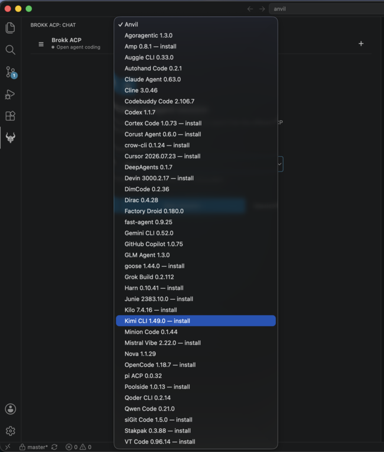
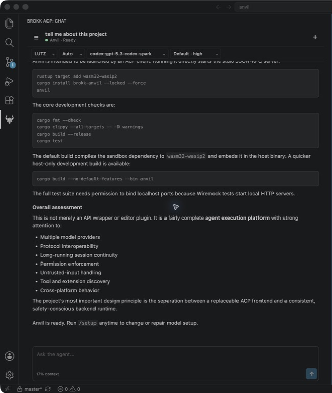

# Brokk ACP

Brokk ACP is an open-source Agent Client Protocol client for Visual Studio
Code. It provides a session-first coding interface for:

- **Anvil**, bundled as the zero-configuration default;
- agents published in the
  [official ACP Registry](https://agentclientprotocol.com/get-started/registry);
  and
- arbitrary custom ACP servers launched over stdio.

The goal is to make agentic coding in VS Code portable across ACP-compatible
agents instead of coupling the editor to one provider.

## Brokk ACP in action

### Choose from the ACP registry



### Work in a persistent coding session



Choose bundled Anvil, a custom stdio server, or an agent from the official ACP
registry. Sessions keep configuration, structured agent activity, rendered
Markdown, and the prompt composer together in the VS Code sidebar.

## Current capabilities

### Agents

- Platform-specific VSIX packages bundle Anvil and the native Rust ACP host.
- The official registry is refreshed live and cached for offline startup.
- Registry binaries are selected by platform, checksum-verified, and extracted
  with path-traversal protection.
- Registry agents launched through `npx` or `uvx` are supported when the
  corresponding runner is available on `PATH`.
- Multiple custom stdio agents can be defined in user or workspace settings.
- ACP terminal and environment-variable authentication are surfaced through
  VS Code; entered secrets are retained in Secret Storage.

### Sessions and chat

- Create, browse, reopen, and delete sessions when the selected agent advertises
  the corresponding ACP session capabilities.
- Session metadata and structured transcripts are cached per workspace and
  restored after a VS Code reload.
- Reopening a remote session prefers `session/load` for an authoritative
  transcript replay and falls back to `session/resume` when load is unavailable.
- Connection startup, authentication, session loading, cancellation, errors,
  and agent switching have visible progress in the chat interface.
- Messages, thoughts, tool calls, permissions, usage, and errors remain grouped
  into coherent turns rather than a raw output stream.
- Standard ACP plans stay visible in a collapsible progress dock with live
  status, priority, and completion updates.
- Agent-advertised configuration values stay visible in a compact session
  status line, with the full controls available from a dedicated editor.
- Typing `/` opens autocomplete for the session's live ACP
  `available_commands_update` list, including descriptions and input hints.
  Use Up/Down to navigate, Enter or Tab to insert, and Escape to close.
- Attach, paste, or drag and drop images when the connected agent advertises
  the standard ACP image prompt capability. Select or drop several at once, or
  use the visible add-another control beside the previews. Brokk ACP forwards
  the attachments without imposing its own format, count, or byte limits.
  Attachments are previewed before sending and remain identified in the
  transcript.

### ACP client surface

- ACP v1 initialization and prompt streaming.
- Agent-requested permission choices.
- Workspace-scoped text-file reads and writes.
- Client-owned terminal creation, output, waiting, termination, and release.
- Prompt cancellation.
- Interruptible connection startup, so replacing a hung launch does not wedge
  the host.

The ACP Registry contains **agents** (servers). Brokk ACP is the client that
installs, launches, and presents them.

## Install

Brokk ACP is packaged as platform-specific VSIX files. To build and install one
from this checkout:

```bash
npm ci
npm run package -- --target darwin-arm64
code --install-extension artifacts/brokk-vscode-acp-*-darwin-arm64.vsix
```

Replace `darwin-arm64` with the target for the machine running the VS Code
extension host:

- `darwin-arm64`
- `darwin-x64`
- `linux-arm64`
- `linux-x64`
- `win32-x64`

Packaging requires Node.js 20 or newer and Rust. The packaging script downloads
the pinned Anvil release, verifies its digest, builds the matching Rust host,
and includes the required license notices and complete corresponding source.

After publication, install from the VS Code Marketplace with:

```bash
code --install-extension brokk.brokk-vscode-acp
```

## Use

1. Open a trusted folder or workspace in VS Code.
2. Open **Brokk ACP** from the Activity Bar.
3. Choose bundled **Anvil**, an installed registry agent, or a custom agent.
4. Start a new session, or open **Sessions** to discover and resume sessions
   exposed by that agent.
5. Prompt the agent from the composer. Use `/` to discover commands advertised
   for the active session. For image-capable agents, use the attachment button,
   paste an image, or drag image files directly onto the composer. Select
   several files at once or add them one at a time for a multi-image prompt.
6. Review permission requests and agent activity in the structured transcript.
   Stop cancels the active prompt.

Registry binary agents are installed into the extension's global-storage
directory. Package agents use the package and arguments from their registry
entry through `npx --yes` or `uvx`.

## Custom ACP agents

Add custom stdio servers to user or workspace settings. Each key becomes a
stable agent ID:

```json
{
  "brokkAcp.customAgents": {
    "my-agent": {
      "name": "My ACP Agent",
      "command": "/absolute/path/to/my-agent",
      "args": ["--acp"],
      "env": {
        "MY_AGENT_PROFILE": "work"
      }
    }
  }
}
```

The agent appears as `custom:my-agent`. `name`, `args`, and `env` are optional;
`command` is required. The older `brokkAcp.agent.command` and
`brokkAcp.agent.args` settings remain readable for compatibility but are
deprecated.

## Settings

| Setting | Purpose |
| --- | --- |
| `brokkAcp.defaultAgent` | Initial agent ID; defaults to `bundled:anvil`. |
| `brokkAcp.registry.url` | ACP registry index URL. |
| `brokkAcp.anvil.path` | Override the bundled Anvil executable. |
| `brokkAcp.customAgents` | Custom stdio agents keyed by stable ID. |
| `brokkAcp.host.path` | Development override for the Rust host executable. |

## Current scope

- One ACP agent connection and one active session run at a time in each VS Code
  window. Starting or opening another session cleanly replaces the current
  connection.
- The first folder in a multi-root workspace is the ACP working directory and
  file-access boundary.
- Session listing, deletion, loading, and resuming depend on capabilities
  advertised by the selected agent.
- Resource attachments, elicitation forms, and session forking are not yet
  exposed in the UI.
- Untrusted workspaces are not supported because coding agents can request file
  edits and terminal commands.

## Security boundary

ACP agents are coding agents and may request file edits or commands. Brokk ACP:

- asks using the exact permission choices supplied by the agent;
- advertises file access only within the active workspace folder;
- resolves existing paths and write ancestors before allowing access;
- runs client-owned terminal commands inside that workspace folder;
- caps retained terminal output;
- validates that image payloads carry an image MIME type and valid base64
  before forwarding them without additional client policy;
- stores environment-authentication secrets in VS Code Secret Storage; and
- verifies registry checksums before installing binary distributions.

Only use custom registry URLs and custom agent commands that you trust.

## Architecture

```text
VS Code extension
  ├─ webview, workspace session cache, settings, and Secret Storage
  └─ newline-delimited JSON commands/events
       └─ brokk-acp-host (Rust sidecar)
            ├─ ACP connection and session lifecycle
            ├─ registry and verified installer
            ├─ permissions, workspace files, and terminals
            └─ ACP v1 JSON-RPC over stdio
                 └─ Anvil, registry agent, or custom ACP server
```

Rust owns the ACP state machine, agent processes, registry, installation,
permissions, filesystem boundary, and terminal lifecycle. TypeScript owns the
VS Code APIs, webview, workspace-local session cache, Secret Storage prompts,
authentication terminal, and sidecar process relay. Keeping the ACP connection
in a native sidecar isolates agent or protocol failures from the extension
host.

## Development

Requirements are Rust, Node.js 20 or newer, and a local Anvil checkout next to
this repository for the default development agent.

```bash
npm install
npm run check
npm run compile
```

Open this directory in VS Code and run the `Run Extension` launch
configuration. Development mode looks for Anvil at
`../anvil/target/{debug,release}/anvil`; `brokkAcp.anvil.path` overrides it.

Validation commands:

```bash
npm test
npm run coverage
npm run license:check
npm run package -- --target <platform>
```

`npm test` enforces at least 80% coverage on every TypeScript module and every
Rust production module. TypeScript uses per-file statement, branch, function,
and line thresholds; Rust uses production line coverage and excludes inline
test bodies from the calculation. Install `cargo-llvm-cov` 0.8.7 to run the
Rust gate locally. HTML TypeScript results are written to
`coverage/typescript/index.html`.

`cargo-about` version 0.9.1 is required for `npm run license:check`. The tag
release workflow rejects mismatched versions, validates the complete suite,
builds all five supported platform VSIX files, publishes them as one
platform-specific Marketplace version, and attaches them to a GitHub release.

## Corresponding source

Every VSIX carries the exact TypeScript and Rust source, locked dependency
manifests, and build scripts used for that package under `extension/source/`.
This keeps the GPL source available to every recipient independently of
repository visibility. See [SOURCE.md](SOURCE.md).

## License

Brokk ACP is licensed under the GNU General Public License, version 3 only.
See [LICENSE](LICENSE). Bundled and installed agents retain their own licenses;
see [THIRD_PARTY_NOTICES.md](THIRD_PARTY_NOTICES.md). The tracked native-host
dependency inventory and license texts are available directly at
[legal/host/THIRD_PARTY_LICENSES.html](legal/host/THIRD_PARTY_LICENSES.html).
